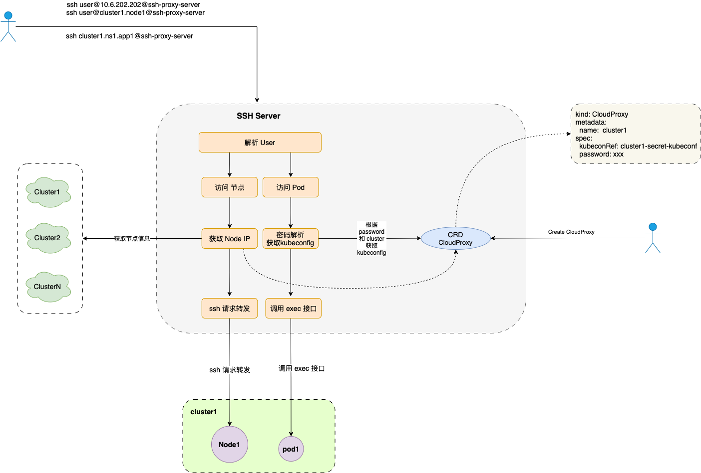

# Cloudtty 支持 ssh 代理 方案设计

## 需求背景

> 来自用户的需求

**支持通过 ssh 的方式连接 cloudtty， 使用方式如： ssh name@cloudtty_link -> 连接到 cloudtty 的 pod**


## 实现的功能和效果
1. 支持通过 ssh 客户端访问 集群中的节点，例如 `ssh root@cluster1.node1@10.6.111.111` 访问 cluster1 集群的 node1 节点；
2. 支持 ssh 客户端访问 pod，例如 `ssh cluster1.ns1.app1@10.6.111.111` 访问 cluster1 集群 ns1 命名空间下 名称为 app1 的 pod；
3. 支持登录多个集群的节点和 pod；
4. 登录的目标 pod 无需支持 ssh server；
5. cloudtty 可以作为访问后端集群节点的跳板机。

## 实现方案

cloudtty 的 ssh 代理功能由新引入的 sshserver 组件实现，sshserver 通过解析访问的 User 信息识别登录节点和登录 pod 的请求，对于登录节点的请求，sshserver 直接将请求转发到后端目标节点，涉及的用户认证交由目标节点处理。对于登录 Pod 的请求，sshserver 根据登录信息获取预先设置的 kubeconfig, sshserver 使用该 kubeconfig 调用目标集群 apiserver 的 exec 接口登录目标 pod。

sshserver 引入了一个新的 CRD `CloudProxy` 保存集群的访问信息。




### CRD
#### CloudProxy 
如果用户需要通过节点名称登录节点，或者登录 pod, 则需要创建一个 CloudProxy 的资源对象（如下示例所示），CloudProxy 用于保存集群的访问信息，主要包括 `kubeconfRef` 和 `password`, kubeconfRef 用于设置访问集群的 kubeconfig, 具体的 kubeconfig 内容保存在 secret 中，password 用于设置登录 pod 所需的密码，在登录 pod 时，sshserver 会对该密码进行验证。

为了不引入 cluster 的概念，将 CloudProxy 资源对象的名称作为登录的集群名称，例如，CloudProxy 的名称为 cluster1，则 ssh 登录使用的集群名称为 cluster1. 

其中的 status 字段用户记录用户的登录信息，包括登录的目标节点或者目标 pod 名称和登录时间。

如果用户只需要通过指定节点 IP 登录节点，则无需创建该 CRD 资源。

```yaml
apiVersion: cloudtty.io/v1alpha1
kind: CloudProxy
metadata:
  name: cluster1
spec:
  kubeconfRef:
    name: cluster1-kubeconf 
    namespace: cloudtty-system
  password: "123456"
status:
  - type: "node"
    name: "node1"
    loginTime: "2024-04-08T02:09:27Z"
  - type: "pod"
    name: "ns1.pod1"
    loginTime: "2024-04-08T02:07:27Z"
```

### 用户名解析

sshserver 收到客户端请求后，需要解析 user 信息，获取到的 user 格式包括 `root@10.6.202.111`, `root@cluster1.node1`, `cluster1.ns1.pod1`, `cluster.ns1.pod1.container1`。如果用户指定了 IP, 例如 `root@10.6.202.111`，或者 user 格式为 `root@xxx.xxx` 。则认为是登录节点。为了区分客户端是登录节点还是登录 pod, 在登录 Pod 时不能省略 default 命名空间。对于 `xxx.xxx.xxx` 或者 `xxx.xxx.xxx.xxx` 的请求认为是登录 pod。


### sshserver 核心工作流程
sshserver 收到客户端请求后，解析 user 信息，针对不同的 user 格式，采用不同的处理流程。

**登录节点**

sshserver 支持两种方式登录节点，一种是直接指定目标节点IP，例如 `root@10.6.202.111`，sshserver 直接将请求转发到该目标节点。另一种是通过节点名称登录，例如 `root@cluster1.node1`， sshserver 解析出登录的用户名为 root, 集群名称为 cluster1, 节点名称为 node1, sshserver 会从 CloudProxy 中获取对应的 kubeconfig，然后从目标集群中获取节点信息，解析出对应的节点 IP，最后 sshserver 将请求转发到目标节点。由于登录节点过程中用户认证是由目标节点处理，所以支持用户名密码和密钥对两种认证方式。

**登录Pod**

用户可通过形如 `ssh cluster1.ns1.app1@10.6.111.111`的方式登录 pod, 登录 pod 时，需要输入密码，该密码需要和 CloudProxy 中的密码相匹配。sshserver 根据 `cluster1.ns1.pod1` 解析出集群名称为 cluster1, 命名空间为 ns1, pod 名称为 pod1, sshserver 会先根据集群名称和和密码获取对应的 kubeconfig, 如果能够成功匹配, 则认为是登录成功。登录成功后，sshserver 使用获取到的 kubeconfig 访问目标集群的 exec 接口进入目标 pod，并将数据流转发到客户端。
当前登录 pod 只支持密码认证，不支持 ssh 密钥对登录。


### 其他

1. 当前调研了两个开源项目，[sshpiper](https://github.com/tg123/sshpiper) 和 [gliderlabs/ssh](https://github.com/gliderlabs/ssh), sshpiper 基于 [golang.org/x/crypto](https://pkg.go.dev/golang.org/x/crypto/ssh) 实现了 sshd 的反向代理，功能强大，但偏底层，且对官方的 golang.org/x/crypto 进行了修改，开发和维护难度较大，但易于实现登录节点的需求。gliderlabs/ssh 对 [golang.org/x/crypto](https://pkg.go.dev/golang.org/x/crypto/ssh) 进行了封装，提供了便捷的方式来构建自定义的 SSH 服务，易于实现登录 pod 的需求。当前还需要评估使用哪一个开源项目来实现我们的sshserver。
2. 当前登录 pod 只支持密码认证，不支持 ssh 密钥对登录。后续如果有需要，考虑实现秘钥对方式登录。